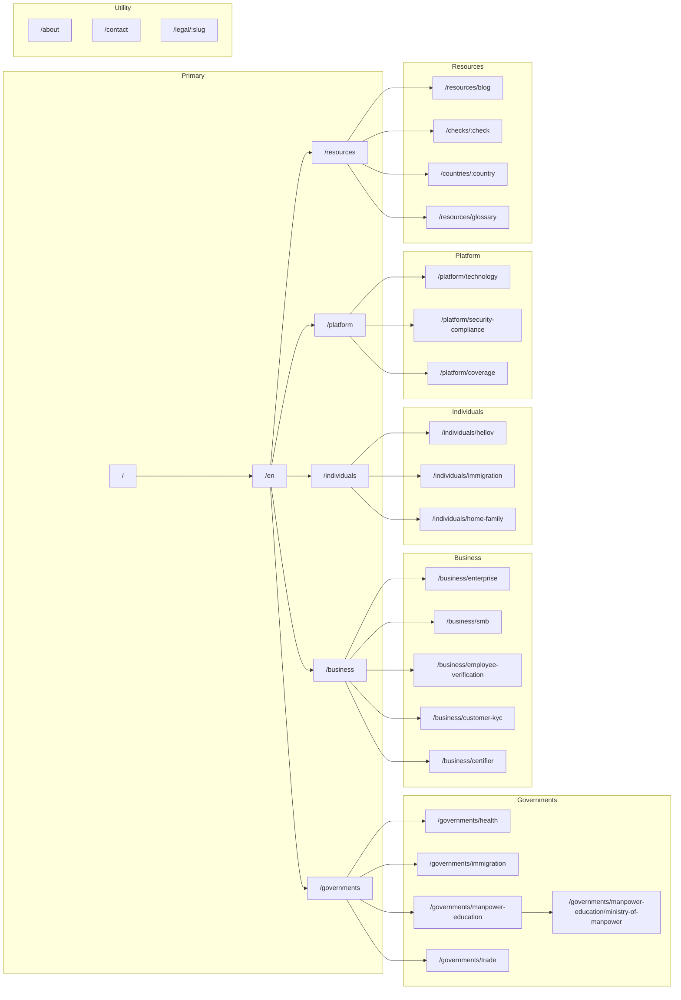
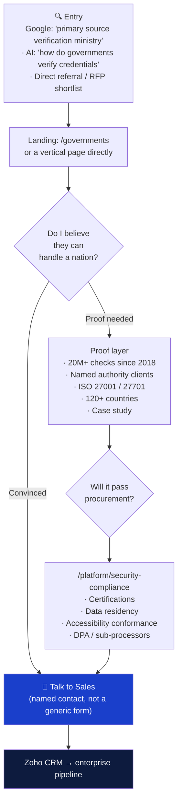
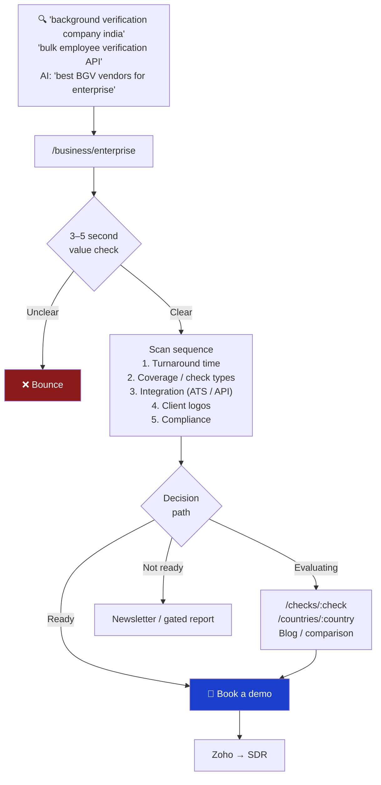
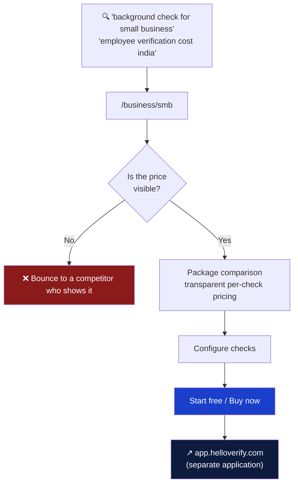
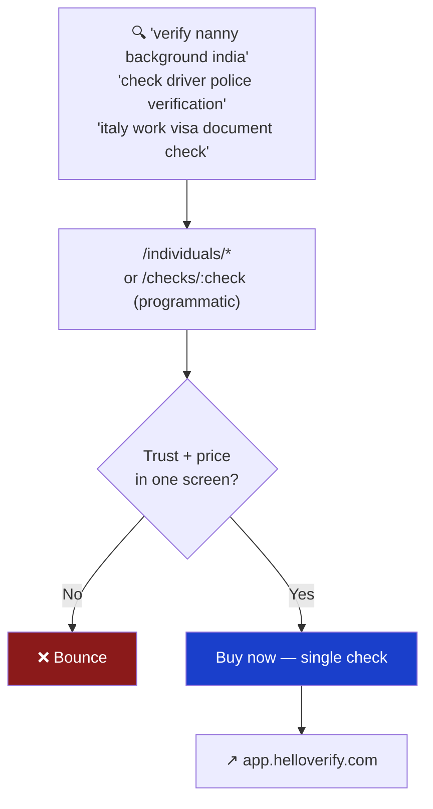
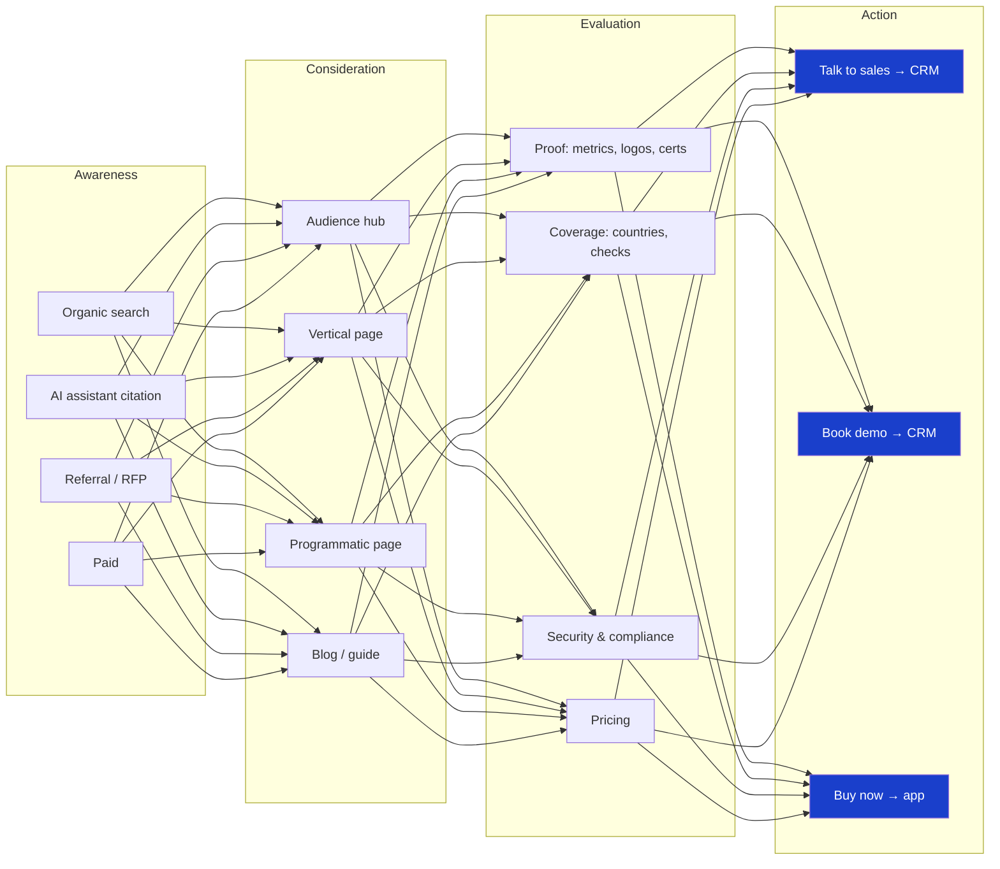
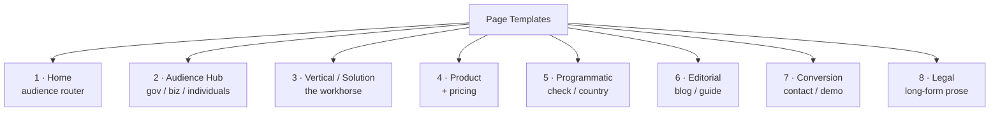
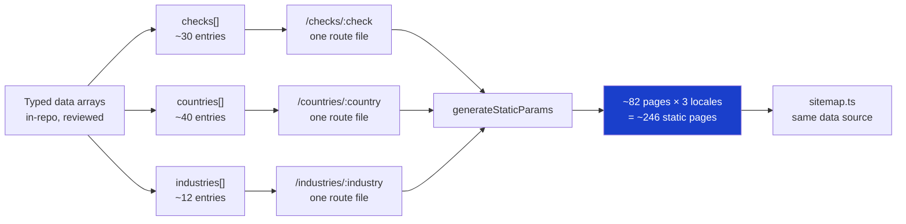

# HelloVerify — Information Architecture & Page Flows

**Companion to:** `[AUDIT.md](./AUDIT.md)` · `[BUILD-SPEC.md](./BUILD-SPEC.md)` · `[DESIGN-RESEARCH.md](./DESIGN-RESEARCH.md)`
**Purpose:** Make the site visible as a system — who arrives, what they need, where they go, and where money is made.
**Status:** Proposed. Diagrams render natively on GitHub.

---

## 1. The core problem with the current IA

The existing navigation is organised around **how HelloVerify is internally structured**, not around **who is buying**.

```
Solutions ▾   Products ▾   Premium Services ▾   About Us   Support ▾   Technology
```

Three of those six are ambiguous to a visitor:


| Menu                 | Actual contents                                                                                  | Problem                                                                                           |
| -------------------- | ------------------------------------------------------------------------------------------------ | ------------------------------------------------------------------------------------------------- |
| **Solutions**        | Government authorities + Enterprise/SMB + Consumer — *three different audiences in one dropdown* | A ministry official and a nanny-hiring parent are offered the same menu                           |
| **Products**         | The same six offerings as "Solutions", framed differently                                        | `/enterprise` and `/products/bgv-enterprise` are the **same page component** rendered at two URLs |
| **Premium Services** | 3 items, 2 of which duplicate "Products", 1 of which has no page at all                          | The parent link goes to `/contact` — a menu that leads to a form                                  |


**Measured consequences** (from `AUDIT.md`):

- `EnterprisePage` is mounted at **two routes**; `ImmigrationMigrationServicePage` at **two routes**
- 10 of 28 routes are redirects to other routes
- "Premium Services → Doctor, Dentist & Other Health Practitioners" links **nowhere** — the route redirects to home
- "Support" is a single link to a contact form wearing a dropdown
- Consumer offerings hide behind an anchor link: `/#consumer-services`

The result is a navigation that requires the visitor to already understand HelloVerify's org chart.

---


## 2. Proposed IA — audience-first

One principle: **a visitor should find their path in one decision, not three.**

```mermaid
graph TD
    H["🏠 Home<br/>/en"]

    H --> G["Governments<br/>/en/governments"]
    H --> B["Business<br/>/en/business"]
    H --> I["Individuals<br/>/en/individuals"]
    H --> P["Platform<br/>/en/platform"]
    H --> R["Resources<br/>/en/resources"]

    G --> G1["Health Authorities"]
    G --> G2["Immigration Authorities"]
    G --> G3["Manpower & Education"]
    G --> G4["Trade & Business Authorities"]

    B --> B1["Enterprise BGV"]
    B --> B2["SMB BGV"]
    B --> B3["Employee Verification"]
    B --> B4["Customer KYC"]
    B --> B5["Certifier — Vendor DD"]

    I --> I1["HelloV — Verify Anyone"]
    I --> I2["Visa & Immigration Screening"]
    I --> I3["Home & Family Checks"]

    P --> P1["Technology & APIs"]
    P --> P2["Security & Compliance"]
    P --> P3["Global Coverage — 120+ countries"]

    R --> R1["Blog"]
    R --> R2["Check Types Library"]
    R --> R3["Country Guides"]
    R --> R4["Glossary"]

    style H fill:#0D1B3E,color:#fff
    style G fill:#1A3FCB,color:#fff
    style B fill:#1A3FCB,color:#fff
    style I fill:#1A3FCB,color:#fff
    style P fill:#1A3FCB,color:#fff
    style R fill:#1A3FCB,color:#fff
```




### Why five, not six


| Nav item        | Job it does                                                | Replaces                                   |
| --------------- | ---------------------------------------------------------- | ------------------------------------------ |
| **Governments** | Self-select for the highest-value buyer. Unambiguous.      | `Solutions` (gov portion)                  |
| **Business**    | Enterprise + SMB + KYC + vendor DD in one place            | `Solutions` (biz) + `Products`             |
| **Individuals** | Consumer/applicant products, currently buried in an anchor | `Premium Services` + `/#consumer-services` |
| **Platform**    | Tech, security, compliance, coverage — the proof layer     | `Technology`                               |
| **Resources**   | The organic-growth engine (§7)                             | `Blog` (footer only today)                 |


`About Us` and `Support` move to the **utility bar** — they are not commercial paths and should not consume primary navigation weight. `Talk to Sales` stays as the single persistent primary CTA.

> **Research basis:** landing pages with a single dominant CTA convert at **13.5%** vs **10.5%** for pages with five or more competing CTAs. Fewer choices reduce cognitive load and shorten decision time. The current header offers *eight* clickable destinations before the fold.

---


## 3. Full sitemap




### Route inventory


| Tier                              | Count                     | Rendering | Notes                                |
| --------------------------------- | ------------------------- | --------- | ------------------------------------ |
| Home                              | 1                         | Static    | Per locale                           |
| Audience hubs                     | 5                         | Static    | New — these do not exist today       |
| Government verticals              | 5                         | Static    | Port existing                        |
| Business verticals                | 5                         | Static    | Port existing, deduplicated          |
| Individual verticals              | 3                         | Static    | Port existing, surfaced from anchors |
| Platform                          | 3                         | Static    | 1 exists, 2 new                      |
| Utility (about/contact)           | 2                         | Static    | Port                                 |
| Legal                             | 6                         | Static    | Port verbatim                        |
| Blog index + posts                | 1 + n                     | Static    | Port 5, grow                         |
| **Programmatic: checks**          | ~30                       | Static    | **New — §7**                         |
| **Programmatic: countries**       | ~40                       | Static    | **New — §7**                         |
| **Base total (pre-programmatic)** | **~36 × 3 locales = 108** |           | vs 84 today                          |


---


## 4. User flows by audience


### 4.1 Government / authority buyer — highest value, longest cycle




**Design implication:** this buyer converts on **evidence, not persuasion**. Procurement will ask for a security posture and — increasingly — an accessibility conformance report (see §8). Every claim on these pages needs a substantiating artefact behind it.

**Critical gap today:** there is no `security-compliance` page. Certifications appear as logo images in a footer strip with no detail page. That is a procurement blocker, not a design preference.

---


### 4.2 Enterprise HR / TA leader




> **Research basis:** hero sections that communicate a clear value proposition convert **35–40% better** than vague ones, and the 2026 standard is demonstrating value within **3–5 seconds**. High-performing B2B H1s average **under 8 words / 44 characters**.
>
> Current H1: *"Hire the Right People Faster Instant AI-Powered Background Checks"* — **9 words, 64 characters, two sentences fused without punctuation.** It also speaks only to employers, while the page below it sells to governments, SMBs, and consumers.

---


### 4.3 SMB — self-serve, price-sensitive




**This is the flow that hands off to the existing SPA.** Per `BUILD-SPEC.md` §2, checkout lives at `app.helloverify.com`; the marketing site's job ends at a well-instrumented outbound link.

> **Research basis:** enterprise buyers in 2026 expect transparency and proof — clear pricing layouts, security certifications, customer logos. Hiding price behind "Talk to sales" for an SMB product costs conversions from a segment that will not take a call.

---


### 4.4 Individual / applicant — highest volume, lowest value




This audience arrives almost entirely on **long-tail search** and, increasingly, **AI assistant answers**. It is the primary beneficiary of the programmatic layer in §7 — and the reason that layer exists.

---


### 4.5 Where the current site loses each audience


| Audience   | Loss point                                    | Cause                               | Fix                                                 |
| ---------- | --------------------------------------------- | ----------------------------------- | --------------------------------------------------- |
| Government | No security/compliance detail page            | Certifications are decorative logos | `/platform/security-compliance` with real artefacts |
| Enterprise | Hero speaks to one audience, page serves four | Undifferentiated homepage           | Audience hubs + segmented homepage                  |
| SMB        | Pricing not visible before contact            | Sales-gated by default              | Transparent package pricing                         |
| Individual | Buried behind `/#consumer-services` anchor    | Not in primary nav                  | `/individuals` hub + programmatic pages             |
| **All**    | **12.5 MB page, no compression**              | `AUDIT.md` A1/B1                    | Rebuild                                             |


---


## 5. Conversion funnel




**One primary CTA per page.** Secondary actions are visually subordinate, never competing. The current header alone presents `Talk to sales`, `Sign Up`, a language switcher, and six menus before content begins.

---


## 6. Page templates

Every page is one of **eight** templates. This is what makes the design system finite — and what prevents a return to 119 one-off components (`AUDIT.md` D2).




### Template 3 — Vertical / Solution (used by ~13 pages)

```
┌──────────────────────────────────────────────┐
│ Breadcrumb                                   │  BreadcrumbList schema
├──────────────────────────────────────────────┤
│ H1 — audience-specific, < 8 words            │  LCP text, no hero image
│ Subhead — one sentence                       │
│ [Primary CTA]   [Secondary]                  │  single dominant action
├──────────────────────────────────────────────┤
│ Trust strip — logos / certs / metrics        │  above the fold
├──────────────────────────────────────────────┤
│ H2 — What we verify        (answer block)    │  AEO-structured, §BUILD-SPEC
│ H2 — How it works          (numbered steps)  │
│ H2 — Turnaround & coverage (comparison table)│
│ H2 — Compliance & security                   │
│ H2 — FAQ                   (FAQPage schema)  │
├──────────────────────────────────────────────┤
│ Closing CTA                                  │
└──────────────────────────────────────────────┘
```

Each `H2` section is a **self-contained, independently citable unit** — that is the structural requirement for AI answer engines (see `BUILD-SPEC.md` §11a), and it happens to also be good information design for humans.

---


## 7. Programmatic layer — the growth engine

`AUDIT.md` C3: ~12 real commercial pages for a company claiming 120+ countries and 30+ check types.




**Three route files. ~246 pages. Zero incremental engineering per page.**

**Hard quality gate.** Each page must carry genuinely differentiated content — real turnaround times, real coverage, real regulatory context. Templated pages with a swapped country name are thin content and will be treated as such by both Google and AI retrieval. This ships in Phase 5, **content-gated**, not before.

---


## 8. Accessibility is a procurement requirement, not a nice-to-have

This belongs in the IA document because it changes what must be on the site.

- EAA enforcement has been active since **28 June 2025**
- **EN 301 549 v4.1.1** was published **2 September 2026** and is expected to be cited in the Official Journal in **November 2026**, making **WCAG 2.2 Level AA** the presumed technical standard
- **Governments and public institutions will only contract with vendors meeting these standards** — a conformance report is now part of public procurement
- A B2B label does not remove exposure for a service sold into the EU market

**HelloVerify sells to ministries.** An accessibility conformance statement is therefore a **sales asset**, and it needs a page:

```
/platform/security-compliance
  ├── Certifications (ISO 27001, ISO 27701, PBSA, GDPR posture)
  ├── Accessibility conformance (WCAG 2.2 AA statement + VPAT)
  ├── Data residency & sub-processors
  └── DPA / security whitepaper request
```

**Blocking finding — see** `DESIGN-RESEARCH.md` **§3:** the current brand blue `#007AFF` measures **4.02:1 against white** and **fails WCAG AA** for normal text. It is used **455 times**, including on primary CTA labels. This is a live conformance failure on the brand colour itself.

---


## 9. URL migration map

Per `BUILD-SPEC.md` §6.2, every legacy path becomes a real server **308**.


| Legacy URL                                             | New URL                                      | Why                                                   |
| ------------------------------------------------------ | -------------------------------------------- | ----------------------------------------------------- |
| `/en/enterprise`                                       | `/en/business/enterprise`                    | Duplicate of `/products/bgv-enterprise` — consolidate |
| `/en/products/bgv-enterprise`                          | `/en/business/enterprise`                    | Same component, two URLs                              |
| `/en/products/bgv-smb`                                 | `/en/business/smb`                           |                                                       |
| `/en/smb`                                              | `/en/business/smb`                           | Already a redirect                                    |
| `/en/employee-verification`                            | `/en/business/employee-verification`         |                                                       |
| `/en/products/customer-kyc`                            | `/en/business/customer-kyc`                  |                                                       |
| `/en/kyc`                                              | `/en/business/customer-kyc`                  | Already a redirect                                    |
| `/en/products/trust-safety`                            | `/en/business/customer-kyc`                  | Already a redirect                                    |
| `/en/products/certifier`                               | `/en/business/certifier`                     |                                                       |
| `/en/solutions/health-authorities`                     | `/en/governments/health`                     |                                                       |
| `/en/solutions/immigration-authorities`                | `/en/governments/immigration`                |                                                       |
| `/en/solutions/manpower-and-education-authorities`     | `/en/governments/manpower-education`         | Shorter, same meaning                                 |
| `/en/solutions/trade-authorities`                      | `/en/governments/trade`                      |                                                       |
| `/en/solutions/business-trade`                         | `/en/governments/trade`                      | Already a redirect                                    |
| `/en/products/hellov`                                  | `/en/individuals/hellov`                     |                                                       |
| `/en/consumer`, `/consumer/basic`, `/consumer/premium` | `/en/individuals/hellov`                     | Already redirects                                     |
| `/en/premium/consumer-service`                         | `/en/individuals/hellov`                     | Already a redirect                                    |
| `/en/products/immigration`                             | `/en/individuals/immigration`                |                                                       |
| `/en/visa-screening`                                   | `/en/individuals/immigration`                | Already a redirect                                    |
| `/en/technology`                                       | `/en/platform/technology`                    |                                                       |
| `/en/international`                                    | `/en/platform/coverage`                      |                                                       |
| `/en/blog`, `/en/blog/*`                               | `/en/resources/blog`, `/en/resources/blog/*` |                                                       |
| `/en/signup`, `/support*`, `/premium`                  | `/en/contact`                                | Already redirects                                     |
| `/en/solutions`, `/en/products`                        | `/en/governments`, `/en/business`            | Now real hub pages, not redirects to home             |
| `/en/privacy-policy` etc.                              | `/en/legal/privacy-policy`                   | Grouped                                               |
| `/<any>/index.html`                                    | **clean form**                               | `AUDIT.md` **A2 — these are indexed today**           |


**Rules:**

- Every legacy URL gets a **308**, never a 404, never a JS redirect
- All 3 locales, all paths
- The `/index.html` family must be explicitly consolidated — it is in Google's index right now
- Old sitemap stays served for 30 days post-cutover

**Implemented** in `helloverify-web/src/lib/seo/legacy-urls.ts`. Five things the table above did not anticipate:

| | |
| --- | --- |
| `/hi/*`, `/ar/*` | 56 of the 84 indexed URLs. They **consolidate onto English**, since those pages do not exist here. The debt: when `hi` ships it must reclaim URLs that were already 308'd away. |
| `/blog/<4 slugs>` | The four indexed posts did not come across — `posts.ts` has two unrelated slugs. Each 308s to the live page on the **same subject** (`/checks/criminal`, `/checks/current-address`, `/platform/security-compliance` ×2), not to the blog index: Google treats a redirect to a generic index as a soft 404. Second-best; porting the posts beats it. |
| `/terms-and-conditions` | → `/legal/terms-of-service`. A rename, not just a regrouping. |
| `/equal-opportunities`, `/criminal-convictions-policy` | Indexed policies with **no successor**. Both were added to `lib/content/legal.ts` as skeletons carrying the old pages' own section ids, so the verbatim port is a paste per section. Legal document count: 6 → 8. |
| `/cart`, `/cartlist`, `/orders*`, `/profile-settings`, `/consumer/passwordrecovery/*`, `/consumer/PayUPayment/PaymentSuccess1` | SPA routes, 308 to `app.helloverify.com` per `BUILD-SPEC.md` §18 decision 1. 308 rather than 302 is load-bearing: it preserves the request method, so PayU's POSTed callback stays a POST. |

---


## 10. Open IA decisions


| #   | Question                                                                                            | Recommendation                                                                                                        |
| --- | --------------------------------------------------------------------------------------------------- | --------------------------------------------------------------------------------------------------------------------- |
| 1   | Do the audience hubs (`/governments`, `/business`, `/individuals`) get real content, or just route? | **Real content.** A hub that only lists links is a thin page and wastes the strongest commercial keyword on the site. |
| 2   | Does "Certifier" stay a distinct brand, or become "Vendor Due Diligence"?                           | Descriptive naming. Nobody searches "Certifier".                                                                      |
| 3   | Does "HelloV" stay a distinct brand?                                                                | Likely yes — it has consumer recall — but the page title must lead with the job, not the brand.                       |
| 4   | Does pricing go public for SMB?                                                                     | **Yes.** See §4.3. Needs commercial sign-off.                                                                         |
| 5   | Blog → "Resources": who owns editorial?                                                             | Needs an owner before Phase 5. Five posts is not a programme.                                                         |
| 6   | Is `about.helloverify.com`-style investor content in scope?                                         | Out of scope for v1; `/about` covers it.                                                                              |


---


## Sources

- [Single-CTA conversion data & cognitive load](https://www.saashero.net/design/b2b-saas-landing-page-examples/)
- [B2B SaaS landing page best practices 2026](https://genesysgrowth.com/blog/designing-b2b-saas-landing-pages)
- [Landing page trust signals](https://www.saashero.net/design/landing-page-design-trust-signals/)
- [B2B SaaS design trends 2026](https://www.designrush.com/best-designs/websites/trends/b2b-saas-website-design)
- [EAA compliance & WCAG 2.2 timeline](https://www.levelaccess.com/compliance-overview/european-accessibility-act-eaa/)
- [EAA applicability to B2B](https://eye-able.com/blog/eaa-b2b)
- [AEO content structure & semantic chunking](https://llmrefs.com/answer-engine-optimization)

